# Report for Assignment 1

## Project chosen

Name: The Algorithms - C++

URL: [https://github.com/TheAlgorithms/C-Plus-Plus](https://github.com/TheAlgorithms/C-Plus-Plus)

Number of lines of code and the tool used to count it: 31 KLOC (Measured using lizard)
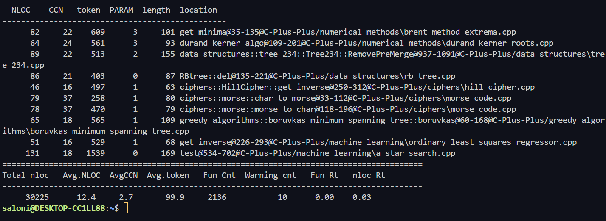

Programming language: C++

## Coverage measurement

### Existing tool

To measure the coverage we used lcov. To execute it we made a small script that generates coverage information and
automatically creates an HTML report.

generate_coverage.sh:
```
lcov -c -d ./ -o coverage.run
genhtml -o ./html/ coverage.run
```

For lcov to be able to capture coverage data we had to add some flags in the CMakeLists.txt:
```
include(CodeCoverage.cmake)
APPEND_COVERAGE_COMPILER_FLAGS()
```

After setting up cmake with `cmake .`, compiling the project using `make` and running the tests with `ctest`, the 
coverage report can be generated using generate_coverage.sh.

Because lcov coverage can only go up when re-running tests, never down, we made a small script that removes all
existing coverage data, called reset_coverage.sh.

Coverage results:


### Your own coverage tool

#### <u>Alejandro Guerena Gonzalez</u>

###### bool Tree234::TryRightRotate(Node *parent, Node *to_child)
###### void Tree234::Traverse(Node *node)

**Link to commit:** [Commit hash: d7ea02e](https://github.com/Flipkaboom/SEP_not_Pandas/commit/d7ea02e9e652519af13ef7e286294ecd4b9af172)

This commit shows the map data structure used to track if statements in 2 branches for both functions are executed. This is displayed through the added functions print_right_rotate_coverage() and print_traverse_coverage() to show if these branches are hit.

**Link to commit:** [Commit hash: efaa53a](https://github.com/Flipkaboom/SEP_not_Pandas/commit/efaa53a35da0d582ba89821849abc86e4caeabf8)

This commit shows the addition of checking the 'invisible' else branch of TryRightRotate() function, in the case that neither of the two brances are executed. Totaling to 3 branches in the TryRightRotate() functino being checked, and 2 branches in Traverse() function


This image shows the coverage of TryRightRotate() and Traverse() functions through print_right_rotate_coverage() and print_traverse_coverage() before adding tests and improving the coverage.

#### <u>Flip Grim</u>

###### void _insert(int &x, int k)
###### void _erase(int &x, int k)

**Link to commit:** [Commit hash: fed6d31](https://github.com/Flipkaboom/SEP_not_Pandas/commit/fed6d31446934a74023aabfbc42e1225d4c13b01)

In this commit, branch coverage measurement is added to the functions listed above, located in
data_structures/treap.cpp. This is done using two maps that map each branch to a boolean value. After running all tests,
the coverage for each branch is printed, then the overall coverage per function is printed.

Results: 


#### <u>Saloni Bhandari</u>

###### int64_t ncr(const uint64_t& n, const uint64_t& r, const uint64_t& p)
###### int64_t modInverse(const uint64_t& a, const uint64_t& m)

**Link to commit:** [Commit hash: e486ccd](https://github.com/Flipkaboom/SEP_not_Pandas/commit/e486ccd1c831e784f2bfe98a8b49699d4ed04f76)
In this commit I have added branch coverage measurement for the functions ncr and modInverse of math/ncr_modulo_p.cpp. To measure the coverage, I use two maps with strings as keys and bools as value. Whenever a branch is visited, the corresponding boolean is set as true. In the end, I count the number of booleans marked as true, and calculate the percentage as follows:

branch_coverage = #branches_marked_as_true/total_branches * 100

I do this for both functions and then print the coverage as follows:

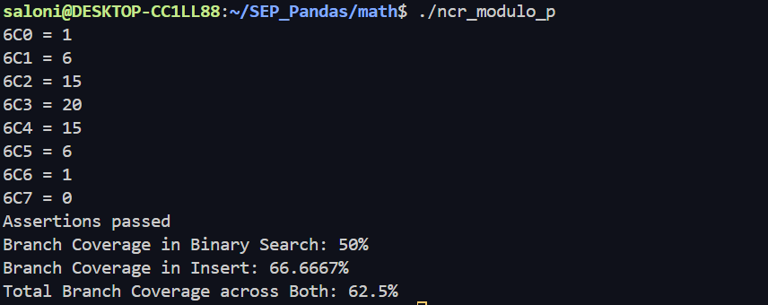

This image shows the coverage of ncr() and modInverse() functions through print_coverage() function before adding tests and improving the coverage.

#### <u>Alessia Frunza</u>

###### node *insert(node *root, int item)
###### node *deleteNode(node *root, int element)

**Link to commit:** [Commit hash: b175a60](https://github.com/Flipkaboom/SEP_Pandas/commit/b175a602b639d05a815b3a685ca1ba709bc29488)
In this commit I have added branch coverage measurement for the functions insert() and deleteNode(), located in data_structures/avltree.cpp. I have done this through the use of two maps that map each branch to a boolean, set initially to false. When a test goes through a certain branch I map it to true. In the end I created a function print_coverage() that loops through each map and counts the booleans set to true. I print my result as number_of_visited_branches/total_branches for each of the two functions.

**Link to commit:** [Commit hash: ebe1e66](https://github.com/Flipkaboom/SEP_Pandas/commit/ebe1e668a69dab86340bbef336c0e7aa4f007146)
In this commit I have added the explicit checking of the "invisible branches" of insert() and deleteNode() functions. 

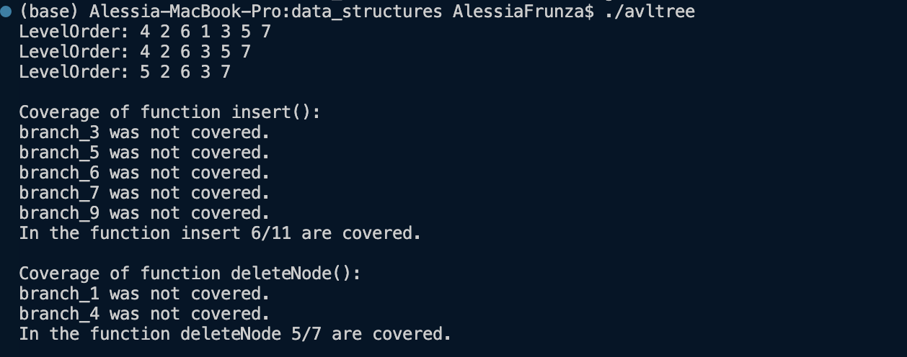

This image shows the coverage of insert() and deleteNode() functions through print_coverage() and print_traverse_coverage() before adding tests and improving the coverage.

## Coverage improvement

### Individual tests

#### <u>Alejandro Guerena Gonzalez</u>

###### void test_right_rotate()
###### void test_traverse()

**Link to commit:** [Commit hash: d7ea02e](https://github.com/Flipkaboom/SEP_not_Pandas/commit/d7ea02e9e652519af13ef7e286294ecd4b9af172)

This commit shows the addition of test_right_rotate() and test_traverse() which indirectly calls the functions described above, since they are private functions. The test_right_rotate() function inserts values to a 234-tree data structure and depending on the structure of the tree, when deleting a node (calling the Remove() function) it may internally call the test_right_rotate() function. Two different tree structures are created in this test function to meet the conditions of the branches when trying to rotate the tree right.

The test_traverse() function is far more simple, though similarly the Traverse(Node *node) function is private therefore the Traverse() public function is utilized to indirectly call the helper function. The Traverse(Node *node) function has two branches: one where the tree is empty and the other when it is not, therefore these two cases are implemented in the test_traverse() function.

**Link to commit:** [Commit hash: efaa53a](https://github.com/Flipkaboom/SEP_not_Pandas/commit/efaa53a35da0d582ba89821849abc86e4caeabf8)

The structure of the tree was changed here, by inserting different nodes to the tree to meet the conditions of the additional 'invisible' branch that was added.


The line coverage within tree_234.cpp was 56.2%. After the introduction of my tests I implemented, the line coverage improved to 78.7%. The branch coverage improved from 69.4% to 90.6% within the tree_234.cpp file. The coverage was improved with the addition of my tests because all the statements within bool Tree234::TryRightRotate(Node *parent, Node *to_child) and void Tree234::Traverse(Node *node) functions were executed atleast once. Prior to the introduction of the tests, none of the lines within these functions were executed.

#### <u>Flip Grim</u>

###### static void test()

**Link to commit:** [Commit hash: 617aba4](https://github.com/Flipkaboom/SEP_not_Pandas/commit/617aba47ea0e95fd84f0a6e69d90bea0f382e552)

Line coverage results before:


Branch coverage results before:


Line coverage results after:


Branch coverage results after:


The original line coverage of treap.cpp was 96.1%. After adding new tests to the test() function the line coverage has
improved to 99.3%.

The original branch coverage (on the instrumented functions) was 10/12 (83.3%) branches reached. After adding the tests
the branch coverages improved to 12/12 (100%).

The treap (the data structure implemented in treap.cpp) supports several of the same element being added to it. When
this happens it will find the identical element already present in the data structure and increase a counter on this
element. This is never tested by the original tests, neither is the code that decreases the counter when a duplicate
element is removed. The added tests add an identical element to an empty treap twice in a row, checking that the element
exists after each addition. The tests then erase that same element twice in a row, checking that it still exists after
the first erase (because there are two of them) and checking that it no longer exists after the second erase.

#### <u>Saloni Bhandari</u>

###### void enhanced_testing()

**Link to commit:** [Commit hash: e486ccd](https://github.com/Flipkaboom/SEP_not_Pandas/commit/e486ccd1c831e784f2bfe98a8b49699d4ed04f76)

In this commit I have added 3 new tests to cover branches that were previously not covered.

**Link to commit:** [Commit hash: 0f5920f](https://github.com/Flipkaboom/SEP_not_Pandas/commit/0f5920fc4073ee92c0b0e7c448c39251cec59992)

In this commit, I have add some extra tests to reach branches that were not previous reached, for more credible results.


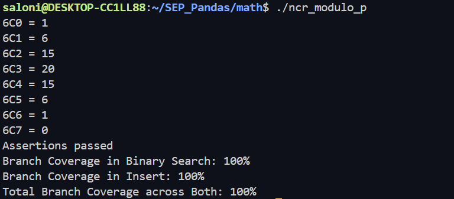

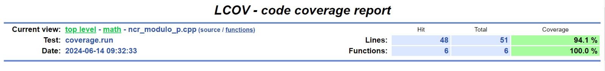
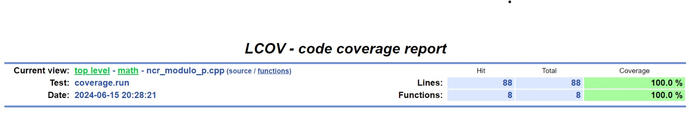

Previously, the branch coverage of modInverse was 50%, and after adding tests it is 100%. Similarly, the branch coverage of insert was 66.6667% and after adding tests the coverage was improved to 100%. After adding tests for both functions, the total branch coverage was increased from 62.5% to 100%. The statement coverage of the entire ncr_modulo_p.cpp file was also increased from 84.1% to 100%. The following images show which branches were not visited before adding tests, and how adding tests increased the coverage.

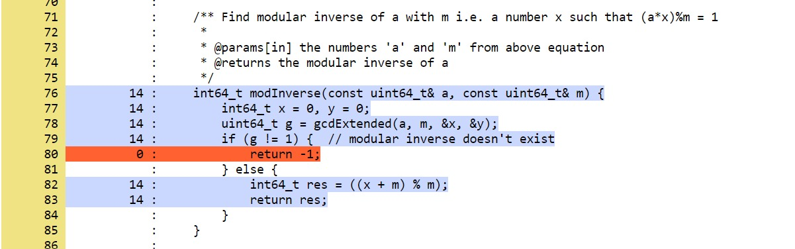
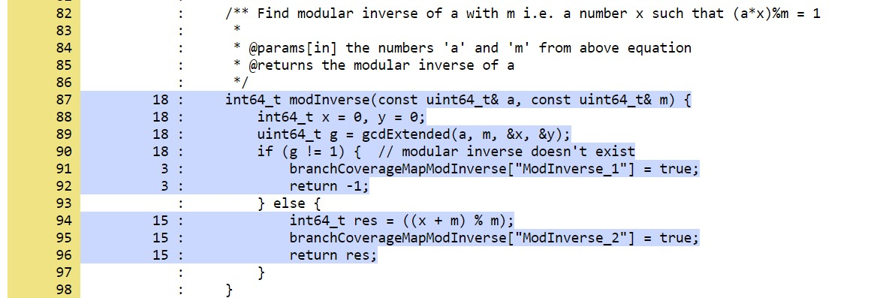

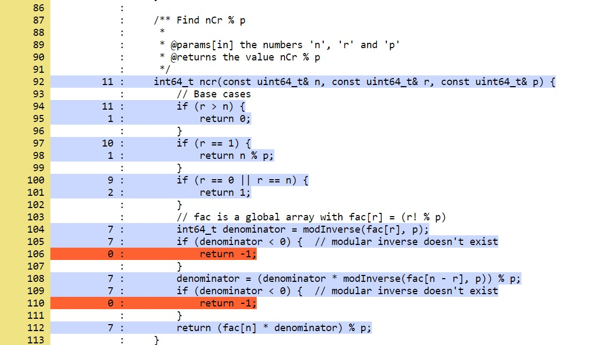
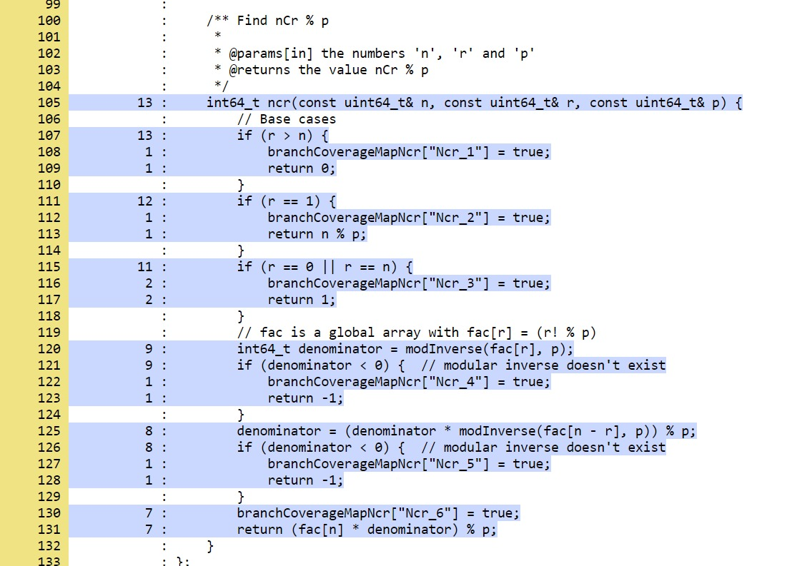

#### <u>Alessia Frunza</u>

###### void test_left_heavy_for_coverage()
###### void test_del_node_two_subtrees()

**Link to commit:** [Commit hash: 2e0ac55](https://github.com/Flipkaboom/SEP_Pandas/commit/2e0ac55a5af98d422a83a56f46adc7fbe1e93ab4)
In this commit I have added test_for_improved_coverage(), later renamed as test_left_heavy_for_coverage(), where I have added a case that makes a left-heavy tree to cover many branches that were previously not covered.

**Link to commit:** [Commit hash: 6224e72](https://github.com/Flipkaboom/SEP_Pandas/commit/6224e722bf7ad08af832b84731b0e6f596d3f760)
In this commit I have added test_del_node_two_subtrees() which is a case where deleteNode() tries to delete a node with both left and right subtrees. This covered all the remaining uncovered branches.


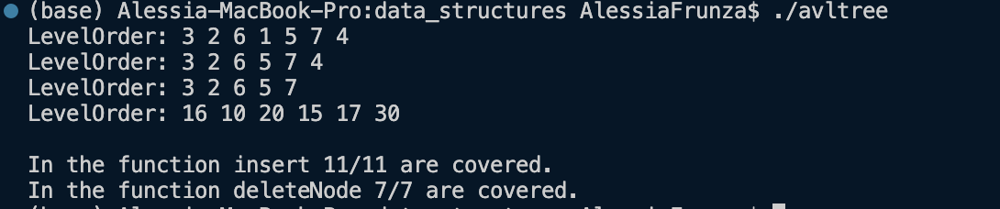

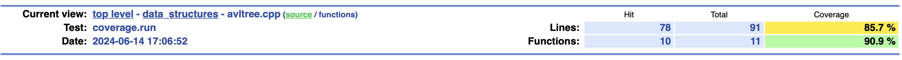
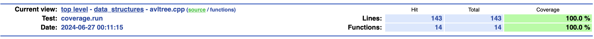

Previously, before adding the tests, 6 out of 11 branches in insert() were covered, after adding my tests it can be seen that 11 out of 11 branches are covered. Similarly for the function deleteNode(), initially 5 out of 7 branches were visited and after adding the tests 7 out of 7 are visited. Previously, the line coverage of avltree.cpp was 85.7%, after adding my new tests, the line coverage now shows 100%.


### Overall

Old coverage result:


New coverage result:


## Statement of individual contributions

#### <u>Flip Grim</u>
- Finding github project to use
- Figuring out how to setup/compile project
- Setup testing
- Setup coverage measurement
- Instrumenting and improving coverage for data_structures/treap.cpp
- Adding overall coverage results to readme

#### <u>Alejandro Guerena Gonzalez</u>
- Finding and testing github project that don't have errors with existing coverage tools
- Instrumenting and improving coverage for data_structures/tree_234.cpp

#### <u>Saloni Bhandari</u>
- Setup testing
- Fixing cMakeLists.txt to include all functions in coverage report
- Instrumenting and improving coverage for math/ncr_modulo_p.cpp
- Adding documentation for readme

#### <u>Alessia Frunza</u>
- Setup testing
- Adding files and functions to the cMakeLists.txt for setup
- Instrumenting and improving coverage for data_structures/avltree.cpp
- Adding documentation to readme
<Write what each group member did>
